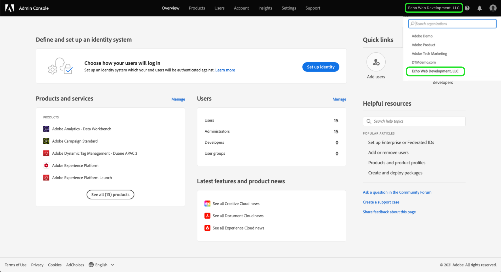

# Grant user access

>[!NOTE]
>
>Adobe Experience Platform Launch is being rebranded as a suite of data collection technologies in Experience Platform. Several terminology changes have rolled out across the product documentation as a result. Please refer to the following [document](../../launch-term-updates.md) for a consolidated reference of the terminology changes.

Before you get started with your extension_package, you need to set up your team members with user accounts and permissions.  This is accomplished in the [Adobe Admin Console](https://adminconsole.adobe.com/).

This document provides steps for granting access to tags in Adobe Experience Platform through Admin Console.

## Prerequisites

This guide assumes you are an Organization Admin as designated by the Admin Console. If you require additional information about the Admin Console and assigning roles, refer to the following resources:

* [Administration user guide](https://helpx.adobe.com/enterprise/administering/user-guide.html?topic=/enterprise/administering/morehelp/introduction.ug.js): Information about all things in the Admin Console
* [Enterprise administration roles](https://helpx.adobe.com/au/enterprise/using/admin-roles.html): More about the different types of administration roles. For the guide below, we'll assume you are an Org Admin.

## Choose your organization

Your Adobe Experience Cloud organization administrator should sign in to the [Admin Console](https://adminconsole.adobe.com/). The first screen is the overview.

Some of you may have access to more than one organization (Org). In order to add the tags capability to the correct Org, select the name of the organization you see in the upper right corner of the screen. Next choose the Org where you want to use tags from the dropdown list.

## Create a product profile

A product profile is a group. Individual rights are assigned to product profiles and any users in the profile will inherit those rights.

Choose the **[!UICONTROL Products]** link at the top, and **[!UICONTROL Experience Cloud]** on the left. If you do not have Adobe Experience Platform Launch listed, customers should contact their account team and partners should email <ExchangeTechEC@adobe.com>.

The screenshot above shows an example profile, you may not have one yet. To create one, select **[!UICONTROL New Profile]**. On the **Create a New Profile** screen, just add a **Profile Name** (Data Collection testing, for example), and an optional **Description**, then select **[!UICONTROL Save]**:

The product profile has now been added to the organization. Next, add users to the product profile.

## Assign users to the product profile

Notice that the product profile shows zero for **ENTITLED USERS** and **ADMINS**. Select the name of the product profile you created (Data Collection testing in our example).

Select the **[!UICONTROL Users]** tab. Here you can search for existing Adobe ID users by email, or add new users to this product profile. Select **[!UICONTROL Add User link]**.

Enter a name, user group or email address in the appropriate text field. It is recommended to include a first and last name where possible. Select **[!UICONTROL Save]** to add the user.

When you have all the users you need in this product profile, we'll add permissions for them. Select the **[!UICONTROL Permissions]** tab. On the permissions screen you'll see **[!UICONTROL Properties]**, **[!UICONTROL Company Rights]**, and **[!UICONTROL Property Rights]**. Select **[!UICONTROL Edit]**.

To author extensions, your team must have a minimum of the following permissions:

* "Manage Properties" from the company group.
* "Manage Extensions", "Manage Environments", and "Develop" from the property group.
  
You can create additional product profiles with more limited rights later if you like, but for now simply select **[!UICONTROL + Add all]** for both **Company Rights** and **Property Rights**. Make sure to select **[!UICONTROL Save]** on each.

So far, we have chosen the appropriate organization, created a product profile, added users to the product profile, and assigned permissions.

This completes the required setup in Admin Console. You and your team members that have been set up as users can now sign in to [the Data Collection UI](https://launch.adobe.com/).

## Confirm provisioning

After your company is provisioned with access to tags and your users are set up as described above, you should be able to access the production environment from the [Data Collection UI](https://launch.adobe.com/). If you have been provisioned for tags and have completed the Admin Console steps above, but still cannot sign in to the Data Collection UI, please contact your Adobe support representatives.
