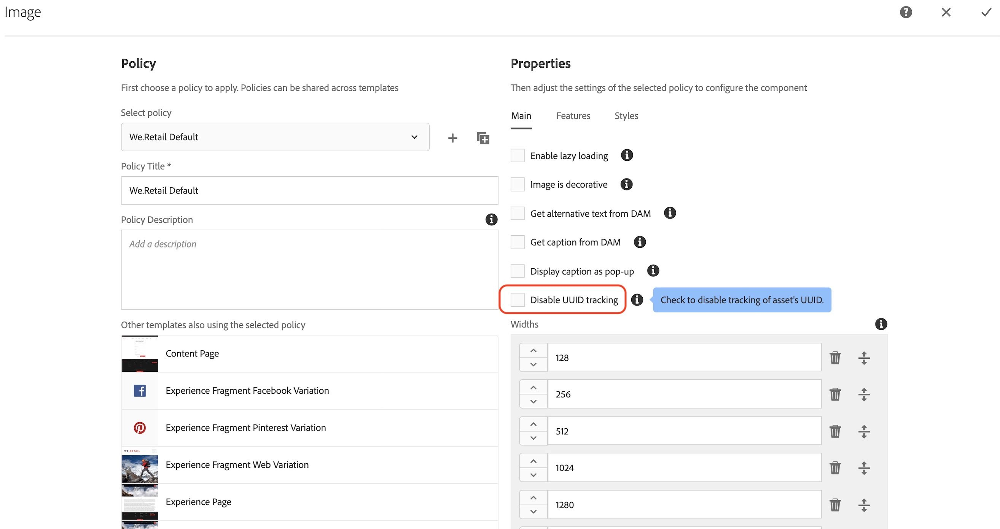
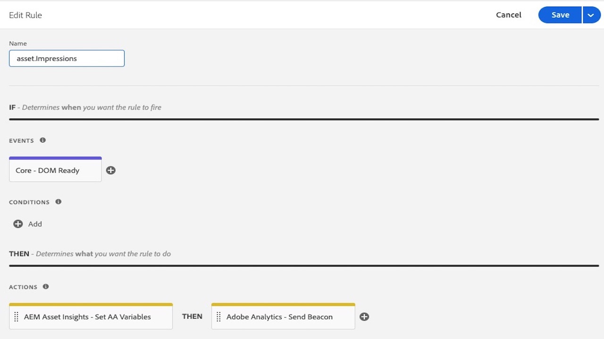

# AEM Asset Insights extension overview

>[!NOTE]
>
>Adobe Experience Platform Launch is being rebranded as a suite of data collection technologies in Experience Platform. These changes will be rolling out across all product documentation in the coming weeks. Please refer to the following [document](../../../launch-term-updates.md) for a consolidated reference of the terminology changes.

This extension is intended to be used together with [AEM Asset Insights](https://experienceleague.adobe.com/docs/experience-manager-65/assets/managing/touch-ui-configuring-asset-insights.html). More specifically, it replaces the "pageTracker" process and embed code. When configured, this extension sends Asset *Impression* and *Click* metrics to Adobe Analytics, after which they will be imported into the AEM Asset Insights reports. The Asset metrics can then be reported on by using either AEM Asset Insights or Adobe Analytics Project Workspaces.

## Extension prerequisites
        
### Analytics

The AEM Asset reports in Analytics contain three AEM dimensions:

* Asset ID
* Asset Source
* Asset Clicked 

There are also two metrics:
* Asset Impressions
* Asset Clicks. 

These reports must be enabled using the Analytics Administrator (select **[!UICONTROL Analytics] > [!UICONTROL Admin] > [!UICONTROL Report Suites] > `<report suite>` > [!UICONTROL Edit Settings] > [!UICONTROL AEM] > [!UICONTROL AEM Assets Reporting]**) before they can be populated using this extension.

The "*Adobe Analytics*" tag extension for Adobe Experience Platform must be installed into the same tags Web Property.
        
### Adobe Experience Manager (AEM)
                        
1. Enable [AEM Asset Insights](https://experienceleague.adobe.com/docs/experience-manager-65/assets/managing/touch-ui-configuring-asset-insights.html). In AEM, select **[!UICONTROL Tools > Assets]**, then open the **[!UICONTROL Insights Configuration]** panel. 
                        
1. Disable UUID Tracking. 

    >[!IMPORTANT] 
    >
    >This extension will *not* function if the AEM Asset configuration setting **[!UICONTROL Disable UUID Tracking]** is checked. It is unchecked by default. 

    
    
## Configure Adobe Experience Manager (AEM)

This section describes how to configure AEM with tags in Adobe Experience Platform, how to enable Asset Insight in AEM, and how to Enable UUID tracking for Assets.

### Integrate AEM with tags in Adobe Experience Platform

The recommended integration of [tags](https://experienceleague.adobe.com/docs/experience-manager-learn/sites/integrations/experience-platform-launch/overview.html) with Adobe Experience Manager is done via Adobe I/O.

1. [Connect AEM with tags in Adobe Experience Platform using Adobe I/O](https://experienceleague.adobe.com/docs/experience-manager-learn/sites/integrations/experience-platform-launch/connect-aem-launch-adobe-io.html).

1. [Create an Adobe Experience Platform Cloud Service configuration](https://experienceleague.adobe.com/docs/experience-manager-learn/sites/integrations/experience-platform-launch/create-launch-cloud-service.html).

### Enable Asset Insight in AEM

For instructions on enabling Asset Insights, see the [Experience Manager 6.5 Assets user guide](https://experienceleague.adobe.com/docs/experience-manager-65/assets/managing/touch-ui-configuring-asset-insights.html).

### Enable UUID tracking for Assets

Track assets in Analytics using the UUID of the asset in AEM. 

To enable tracking with the UUID of the asset, open the component policy console of the editable template and uncheck the "Disable UUID tracking" property. (By default, this property is checked for the OOTB image component.)
 

After you enable the UUID, you should see the "data-asset-id" data element being populated with the UUID of the asset. Analytics tracks the asset click or impression with this UUID.
 

## Extension usage
    
This extension has two events and one action.
        
* **Asset Clicked:** An _event_ that fires when the visitor selects an AEM Asset that is enabled for tracking and has a destination (href attribute).
        
* **Asset Clicked (No Destination):** An _event_ that fires when the visitor selects an AEM Asset that is enabled for tracking and does not have a destination (no href attribute).
        
* **Set AA Variables:** An _action_ that sets the Analytics variables reserved for AEM Assets (context data variables `a.assets.source`, `a.assets.idlist` and `a.asset.clickedid`) depending on which event was used and how the event and action are configured. This extension does not use any Analytics events, props, or eVars.

### Asset impressions
    
Add the "Set AA Variables" action to a new or existing tag rule that fires on every page and sends an Analytics image request. The "Set AA Variables" action must appear **before** the "Adobe Analytics - Send Beacon" action. Additonal actions can be added as required.
    
In the **[Set AA Variables]** config page, select the **[Viewed Assets]** (default) option. This only sets the Impressions event for assets that are actually seen by the visitor.

>[!NOTE]
>
>Although not recommended, the "Set AA Variables" action also supports a "loaded" option, which sends asset impressions for every asset on the page, whether the visitor saw them or not.
    

    
### Asset clicks
    
Configure a second rule using the "Asset Clicked" event and the "Set AA Variables" action. The "Asset Clicked" event should be configured so "Asset Clicked image request" is set to "On PageLoad" (default). This Rule does not require any Adobe Analytics actions (like Send Beacon) because the Asset ID will be saved in `sessionStorage` and sent by the subsequent Impressions rule.

The "Asset Clicked" event also supports an "Asset Clicked image request" setting of "On Click". This sends the click metric to Analytics immediately and requires an Analytics "Send Beacon" action as well.
    

    
Configure a third rule that will fire when there are Assets on the pages that do not have a destination (no `href` attribute). At a minimum, the new rule needs to use the "Asset Clicked (No Destination)" event as well as the "Set AA Variables" and "Adobe Analytics - Send Beacon" actions. Additonal conditions and actions can be added as required. 
    

    
### Extension testing tips
    
Configure three Rules as described above:

* Asset Impressions
* Asset Clicks
* Asset Clicks with no destination
    
**Impressions** 

1. Navigate to a page that contains AEM assets. 

1. If there are no assets visible in the browser, scroll until you can see at least one asset and select that asset, or just navigate to another page.

1. Look at the Analytics image request. 

    If `a.assets.idlist` contains the Asset IDs that were visable on the previous page, the rule is working correctly. 
    
    If `a.assets.idlist` is not in the image request, it's most likely one of two reasons:
    
    * There was never an asset in the browser's viewing area
    
    * There were no assets on the page configured with [Asset Insights](https://experienceleague.adobe.com/docs/experience-manager-65/assets/managing/touch-ui-configuring-asset-insights.html) enabled in AEM.
    
**Clicks** 

1. Navigate to a page that contains AEM assets.

1. Select one of the Assets. 

In the resulting Analytics image request (from the next page), if `a.assets.idlist` has the Asset IDs on the destination page and `a.assets.clickedid` has the Asset ID of the asset that was selected on the originating page, the rule is working correctly. 

If `a.assets.clickedid` is not in the image request, it's mostly likely because the Asset that was selected did not have [Asset Insights](https://experienceleague.adobe.com/docs/experience-manager-65/assets/managing/touch-ui-configuring-asset-insights.html) enabled in AEM.
    
**Clicks with no destination** 

1. Navigate to a page that contains at least one AEM asset that has no destination (no `href` attribute).

1. Select that asset. 

In the resulting Analytics image request, if `a.assets.clickedid` has the Asset ID, the rule is working correctly. 

If `a.assets.clickedid` is not in the image request, it's mostly likely because the asset that was selected did not have [Asset Insights](https://experienceleague.adobe.com/docs/experience-manager-65/assets/managing/touch-ui-configuring-asset-insights.html) enabled in AEM.
